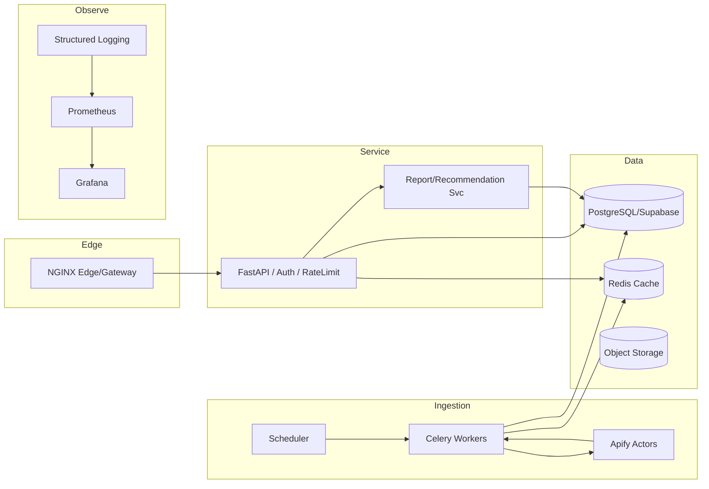
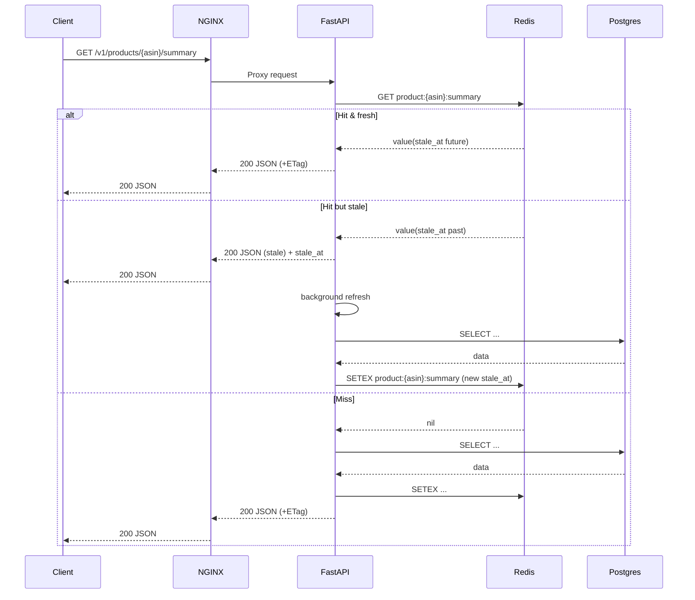

# ARCHITECTURE.md — Amazon 產品監控與優化工具（v2）
> Stack：**Python FastAPI (API)**、**Celery + Redis (Jobs/Cache)**、**Supabase/PostgreSQL (DB)**、**Apify Actors (Amazon Product Details / Reviews)**、**NGINX (Edge/Gateway, optional)**、**Prometheus + Grafana**

---

## 0) 系統目的與範疇
**目標**：給 Amazon 賣家一套「可上線」的後端系統，用以：監控自家商品、分析競品、產出優化建議。  
**重點**：先把**後端**（資料取得、儲存、API、監控）打造完善；前端（Next.js Admin 或其他 UI）可後補，只要遵守 API 契約即可串接。  
**非目標**：不追求即時（sub‑second）實時流；以「**每日/每數小時**」的準即時監控最為務實。

---

## 1) Ingestion Layer（資料取得與排程）
### a. Scheduler（Celery Beat / Cron）
- 排程：每日批（預設 00:30）＋ 健康抽樣（每 6 小時）。
- 任務：`fetch_product_details`、`fetch_reviews_summary`、`compute_kpis`、`detect_anomalies`、`gen_competitive_report`。
- 併發控制：全域限流（與 Apify 速率對齊）、分批分片（見 6.2）。

### b. Workers（Celery Workers）
- 並行呼叫 Apify → 正規化 → 落 DB → 更新 Redis → KPI/異常/報告。
- **冪等性**：`job_id` / `Idempotency-Key` 避免重放副作用。
- **退避/重試**：429/5xx → 指數退避（exponential backoff, jitter）。

### c. 外部來源（Apify Actors / 自建）
- 統一以 Adapter 轉為**標準 JSON**，落地 `staging_raw.raw_events` 以供稽核與重放。

### d. Throughput 規劃（1k+ ASIN/批次）
- **批次分片**：每批 50–100 ASIN；以隊列併發 20–50。每日 1k–5k ASIN 可於 30–120 分鐘完成（依上游限流）。
- **彈性擴充**：Horizontal scale workers（`--concurrency` & replicas）；RabbitMQ/Redis broker 可換（K8s 後切至 SQS/Cloud Tasks 亦可）。
- **資料一致性**：先寫 staging，再升級至正式表，避免半成品污染查詢。

---

## 2) Data Layer（資料儲存/查詢/檔案）
### a. Supabase / PostgreSQL（核心資料庫）
- 主表：`products`、`product_metrics_daily`（時間序）、`competitor_links`、`alerts`、`recommendations`、`ingest_runs`、`staging_raw.raw_events`。
- 查詢關鍵路徑：
  - 最新摘要：`products` + 最近一筆 `product_metrics_daily`。
  - 區間走勢：`product_metrics_daily` by `asin` + 日期窗（建議分區＋索引）。

### b. Redis（讀取加速／成本控制）
- **Cache-first**：API 先查 Redis，miss 再查 DB 回填。
- **SWR（stale‑while‑revalidate）**：過期短期內仍回舊值＋背景刷新；回應帶 `stale_at`。
- **失效**：DB 寫成功後以 **Redis pub/sub** 廣播刪鍵，所有 API 節點同步清。
- 鍵設計：
  - `product:{asin}:summary`
  - `product:{asin}:metrics:daily:{range}`（7d/30d/90d）
  - `compare:{asin_main}:{asin_comp}`
  - `recommendation:{asin}:latest`

### c. 物件儲存（Supabase Storage）
- 報表、匯出檔、截圖、冷資料。

---

## 3) Service Layer（對外服務）
### a. FastAPI（HTTP API）
- 主要端點：
  - `/v1/products/{asin}`
  - `/v1/products/{asin}/metrics?range=30d`
  - `/v1/competitions/{asin}`、`/v1/competitions/{asin}/report`
  - `/v1/recommendations/{asin}`、`/v1/recommendations/{asin}/refresh`
  - `/v1/metrics`（Prometheus）
  - `/v1/health`、`/v1/jobs/{id}`
- 回應標頭：`request_id` / `ETag`；body 帶 `stale_at`（如適用）。
- OpenAPI 契約固定，供契約測試與前端串接。

### b. 認證與授權（Supabase Auth + RBAC）
- JWT 驗 `iss/aud/exp/nbf`；角色：`viewer` / `operator` / `admin`。敏感端點需較高權限。

### c. 報告／建議服務
- 將 KPI 差異轉為可讀**競爭報告**；以版本號落庫，短 TTL 快取於 Redis。

### d. GraphQL
- 端點：`/graphql`（僅讀為主；少量 Mutation 用於觸發刷新/重算）。
- Persisted Queries：只允許事先登錄的查詢（以 `op` = query SHA-256 作為 ID）；前端可改用 `GET /graphql?op=<hash>&vh=<vars_hash>`（`vh` 為變數 JSON 的 SHA-256），利於邊緣快取。
- Resolver 對應：直接讀 Redis（SWR；miss 再查 `mart.*` / `core.*`）。
- 界線：昂貴/具副作用的動作（重算、抓取、設定）仍走 REST /v1/...。
- 治理：啟用 Complexity/Depth 限制（建議：`maxDepth=6`、`maxCost=1000`），Token 級 Rate limit，禁用公開 Playground（只在開發/內網）。

> 如未來完全不需要 GraphQL，刪除此段落即可，不影響 REST 契約

---

## 4) Edge / Gateway（為何建議加 NGINX？）
> 先後端、後前端的路線下，**建議加入 NGINX 作為 Edge/Gateway**（或雲端 LB + NGINX/Caddy/Traefik 皆可）。理由：
1. **TLS 終結 / HTTP/2 / 壓縮**：節省頻寬與 CPU；UVicorn 專注業務邏輯。
2. **連線管理**：處理慢客戶端（buffering/keep‑alive）、保護 API 免受 Slowloris。 
3. **限流/風控**：IP/路徑/Token 維度限流與黑白名單。
4. **微型快取（micro‑cache）**：對**無使用者私密性**且**GET/可快取**的路徑（如 metrics/summary）做 1–10 秒快取，吸收尖峰。
5. **靜態託管**：之後若上 `nextjs-admin`，也可由 Edge 提供靜態檔。
6. **GraphQL**
    - 快取策略：
      - 只對 GET 的 persisted queries 開 micro-cache（1–10s）；
      - 帶 `Authorization` 或非 GET 一律不快取；
      - `proxy_cache_key` 納入 `op`（查詢哈希）與 `vh`（變數哈希），確保不同變數不共用。
    - 限流：邊緣對 `/graphql` 依 Token / IP 施作速率限制；與 REST 保持一致

> 注意：若端點與使用者權限強綁（JWT 不同回不同資料），**不要在 Edge 做共享快取**；或需以 `Vary: Authorization`/ `Cache‑Key` 充分隔離。

---

## 5) Observe Layer（監控維運）
### a. 結構化日誌（JSON）
- `ts, level, service, request_id, job_id, asin, actor, latency_ms, cost, status, error, gql.op, gql.vars_bytes, gql.depth, gql.cost, cache.hit`；敏感值遮罩。

### b. 指標與告警
- **SLO**：API 可用性 ≥ 99%、批次成功率 ≥ 98%、P95 ≤ 500ms、Redis 命中率 ≥ 80%，`gql_requests_total{op=...}`、`gql_latency_ms_bucket`、`gql_cache_hit_ratio`、`gql_n_plus_one_detected_total`。
- 告警：任務連錯、Apify 成本/失敗率超閾、API 5xx 或延遲飆高、Redis 命中率過低、對單 op 的 P95、錯誤率、cost 超閾（如 >1000）與 N+1 次數飆升發出告警。

### c. Prometheus + Grafana
- `/v1/metrics` 暴露指標；Grafana 展示 **API 健康**、**任務管道**、**爬取成本**、**快取效益**。

---

## 6) Deploy Layer（部署交付）
### a. Docker Compose（最小上線單機）
- 服務：`edge`(nginx, optional)｜`api`｜`worker`｜`scheduler`｜`redis`｜（遠端）`supabase`｜`prometheus`｜`grafana`｜（選）`nextjs-admin`。

### b. CI/CD
- Lint/Type → 測試（coverage ≥ 70%）→ Build → Compose 起服務並健康檢查 → 部署（`main` → 測試；**Tag** → Demo/Prod）。

### c. Testing
- `pytest` + `httpx` 整合測試（最小真實子集/假上游）；契約測試（OpenAPI，建議加 `schemathesis`）。

### d. env & docs
- `.env.example` 列鍵名與說明；實際 `.env` 透過安全管道提供（不入版控）。
- 文件集：`ARCHITECTURE.md`（總覽）／`API_DESIGN.md`（契約）／`DATABASE_DESIGN.md`（Schema/索引/分區）／`DESIGN_DECISIONS.md`（取捨）／`README.md`（啟動流程）。

---

## 7) 快取與佇列設計
### 7.1 Redis 快取策略
- **Cache‑first** → **SWR**（回舊值＋背景刷新）→ **失效（pub/sub）**。  
- 鍵命名與 TTL 依路徑拆分（summary/metrics/compare/recommendation）。

### 7.2 任務佇列與批次（Celery + Redis broker）
- 重試與退避（exponential backoff, jitter）；冪等（`job_id`）。
- 分片/限流：依 ASIN 清單切批；遇上游限流自動降頻。
- 批次：batch‑of‑batches、死信隊列與告警；可重放 `staging_raw` 原始資料。

---

## 8) 安全與成本
- **安全**：HTTPS/HSTS；JWT（iss/aud/exp/nbf）；RBAC 最小權限；輸入驗證（ASIN/URL 白名單、body 大小）；CORS/CSP；SSRF 防護（僅允許 Apify 網域）；Secrets 不入版控。
- **成本**：Prometheus 追蹤 Apify/LLM 成本；設上限與告警。以 **快取＋批次＋條件請求（ETag/304）** 降流量與 CPU。
  - **ETag/304**：伺服器回 ETag 指紋；客戶端以 `If-None-Match` 詢問，若未變則 **304**（不傳 body）。
  - **SWR vs ETag**：SWR 是伺服器端更新策略；ETag 是與客戶端協商減流量機制，可並用。

---

## 9) 系統圖（Mermaid）
### a. 高階資料流


### b. SWR 讀取序列


---

## 10) Demo 路徑（口述腳本）
1) **Scheduler 觸發** → Workers 併發呼叫 Apify → 正規化後落 DB、更新 Redis。  
2) **API 查詢** → Cache‑first 讀 Redis；若過期標示 `stale_at` 並背景刷新。  
3) **競品對比/報告** → 批次計算與 LLM 生成 → 版本化存 DB、短 TTL 快取。  
4) **監控面板** → Grafana 顯示 API 健康、任務成功率、外部成本與快取命中率。

---

## 附錄 A：Docker Compose（含 NGINX 節錄）
```yaml
services:
  edge:
    image: nginx:alpine
    ports: ["80:80"]   # 本機測試；實際會加 443 與 TLS
    volumes:
      - ./deploy/nginx/conf.d:/etc/nginx/conf.d:ro
    depends_on:
      - api

  api:
    build: ./api
    env_file: .env
    healthcheck:
      test: ["CMD", "curl", "-f", "http://localhost:8000/health"]
      interval: 15s
      timeout: 3s
      retries: 3
    command: uvicorn app:app --host 0.0.0.0 --port 8000

  worker:
    build: ./worker
    env_file: .env
    command: celery -A tasks worker --loglevel=INFO

  scheduler:
    build: ./worker
    env_file: .env
    command: celery -A tasks beat --loglevel=INFO

  redis:
    image: redis:7
    ports: ["6379:6379"]
```

### NGINX `conf.d/api.conf`（示例）
```nginx
proxy_cache_path /var/cache/nginx levels=1:2 keys_zone=apicache:10m max_size=100m inactive=60m use_temp_path=off;

server {
  listen 80;
  server_name _;

  # 讀寫超時與緩衝，保護後端
  proxy_connect_timeout 5s;
  proxy_read_timeout 30s;
  proxy_send_timeout 30s;
  proxy_buffering on;

  # 壓縮（若上 443 可開 brotli）
  gzip on;
  gzip_types application/json text/plain application/javascript text/css;

  location /v1/ {
    proxy_pass http://api:8000;
    proxy_set_header Host $host;
    proxy_set_header X-Request-Id $request_id;
    proxy_http_version 1.1;
    proxy_set_header Connection "";

    # 微型快取：只對「可共享且非個資」的 GET 路徑開啟
    set $nocache 0;
    if ($request_method != GET) { set $nocache 1; }
    if ($http_authorization != "") { set $nocache 1; }   # 若需權限，避免共享快取
    proxy_no_cache $nocache;
    proxy_cache_bypass $nocache;
    proxy_cache apicache;
    proxy_cache_valid 200 10s;   # 單位秒；可依路徑調整或關閉
    add_header X-Cache-Status $upstream_cache_status;
  }

  # 假設前端用 GET /graphql?op=<sha256_of_query>&vh=<sha256_of_variables>
  # 注意：POST 或帶 Authorization 的請求不快取
  location /graphql {
    proxy_pass http://api:8000;
    proxy_set_header Host $host;
    proxy_http_version 1.1;
    proxy_set_header Connection "";

    set $nocache 1;
    if ($request_method = GET) { set $nocache 0; }
    if ($http_authorization != "") { set $nocache 1; }

    proxy_no_cache $nocache;
    proxy_cache_bypass $nocache;

    # 以 op/vh 兩個哈希為 cache key 的一部分
    proxy_cache_key "$scheme|$host|$uri|op=$arg_op|vh=$arg_vh";
    proxy_cache apicache;
    proxy_cache_valid 200 10s;   # micro-cache 視情況 1–10s
    add_header X-Cache-Status $upstream_cache_status;
  }

  location / {
    return 404;
  }
}
```

---

## 附錄 B：Sizing / Tuning Checklist（速查）
- **API**：Gunicorn/UVicorn workers = `CPU * 2 + 1`（sync）或依待機/IO（async）；開啟 keep‑alive、限速、逾時。  
- **Workers**：`--concurrency` 與 replicas 跟上游限流對齊；任務最長時間與重試上限合理設定。  
- **DB**：`product_metrics_daily` 以日期分區；針對 `(asin, date)` 索引；用 Covering Index 避免回表。  
- **Redis**：設置 maxmemory 與策略（allkeys-lru）；觀察命中率；SWR 參數 `SWR/TTL` 隨端點調整。  
- **Edge**：依路徑設定 micro‑cache；對外開 TLS/HTTP2；限流/黑白單。

---

## 備註
- 若部署在雲端 LB（如 AWS ALB/GCLB）前，再串 NGINX 多數情況仍有價值（快取/限流/壓縮/路由/靜態）。
- 若確定**短期內量很小**、**端點皆需授權**且**沒有尖峰**，可先不加 NGINX，之後再演進。
